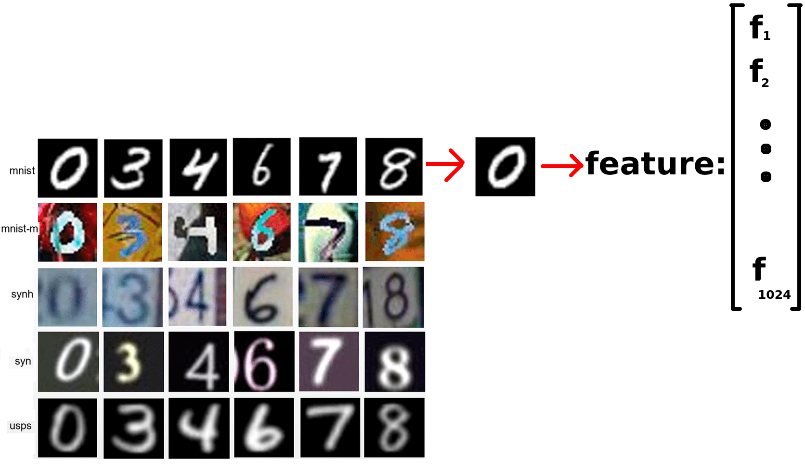
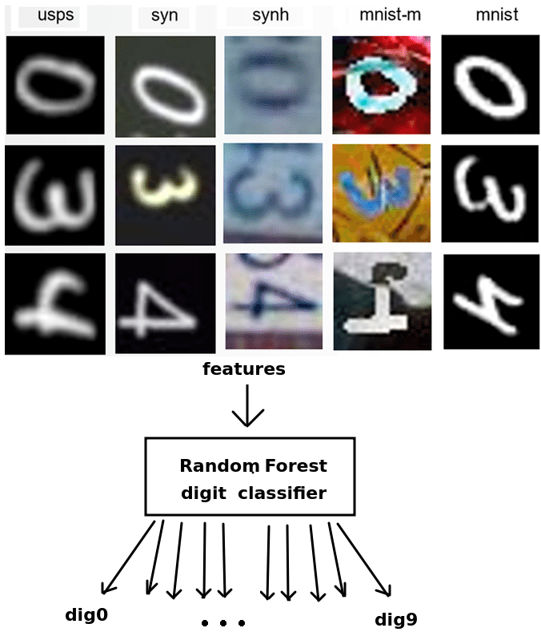
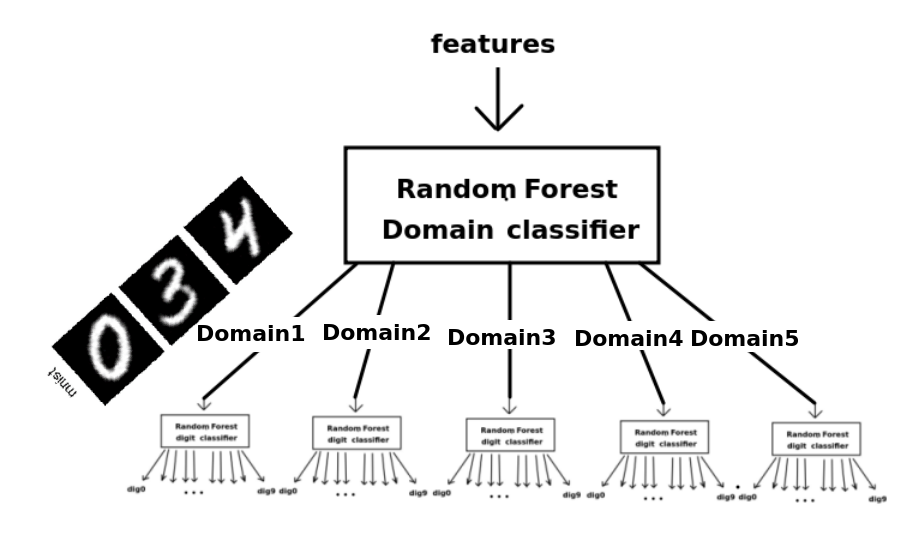
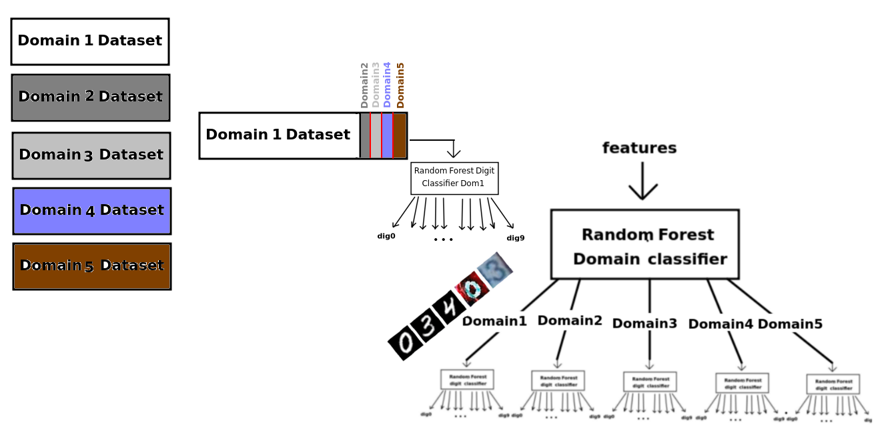

## Multi-Domain Classification - Phase 2

In this project, you will work on multi-domain classification using the Random Forest classifier. The dataset is composed of five different domains, each having classes for numbers 0 to 9. Your task involves three main steps:

<a href="https://drive.google.com/drive/folders/1jlbxKJP1Wt0fQE5MrxaTU3pFSlSV_UfJ?usp=sharing"> - Implemented Code and Dataset on Google Drive</a>

  

### Part 1 - Digit Classification

In the first part, you will directly classify the numbers from the dataset using a Random Forest algorithm. Your challenge is to choose appropriate hyperparameters to achieve the desired accuracy. You need to demonstrate that your hyperparameter choices are effective. Additionally, you should calculate the confusion matrix to assess your model's performance.

  

  

  
</p
  
To conclude, compare the results of all three phases using an appropriate metric (weighted sum or other) and discuss the accuracy achieved in each part.

This project presents a significant challenge in multi-domain classification and will help you gain insights into handling complex, real-world data scenarios.

