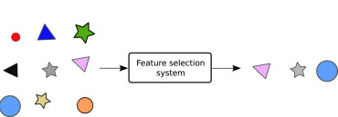
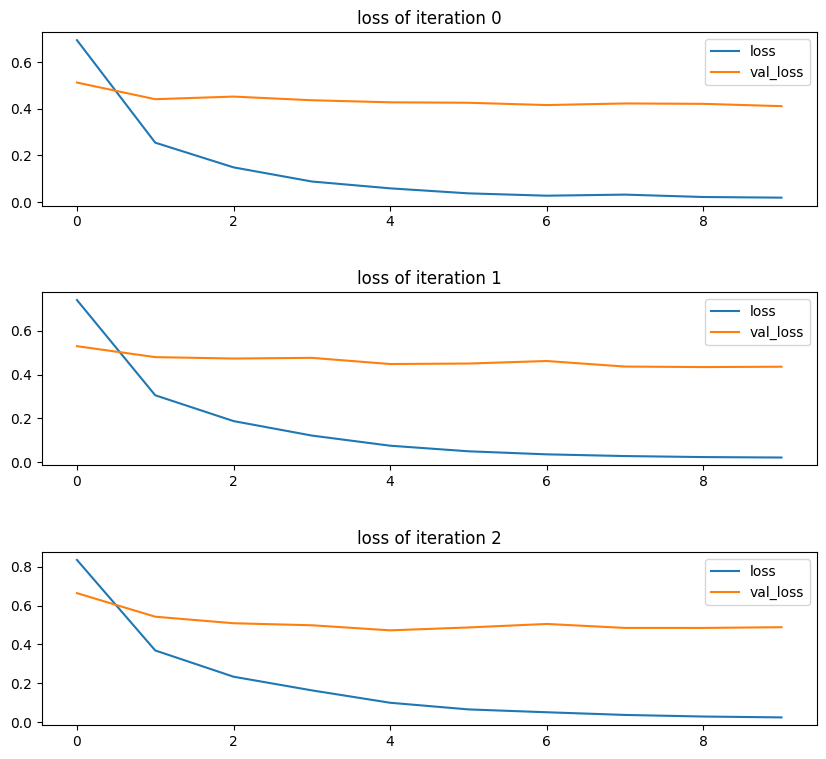
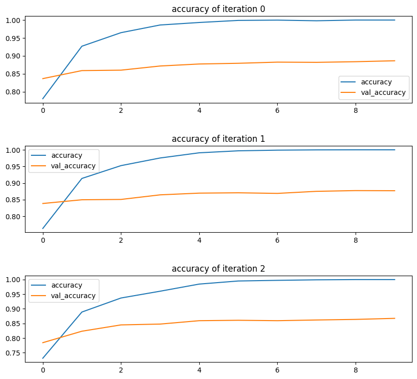
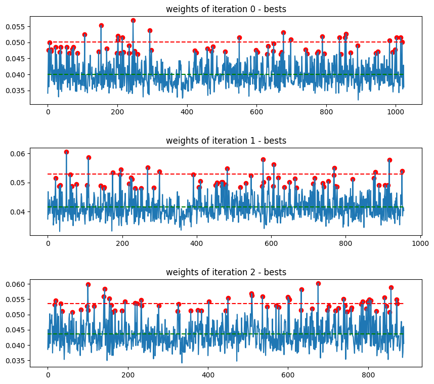
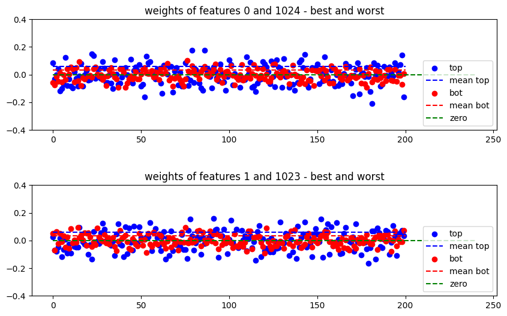
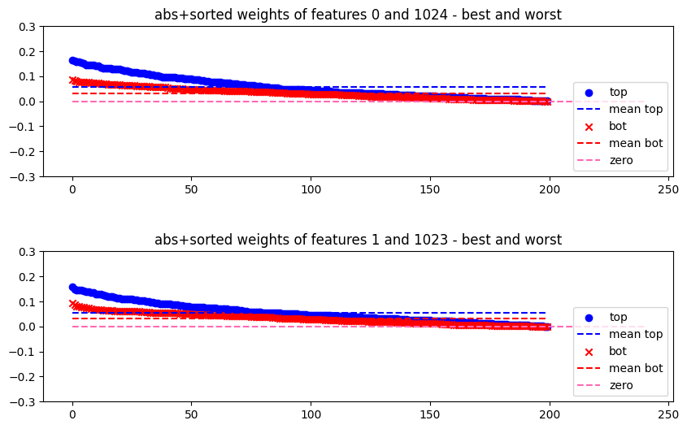
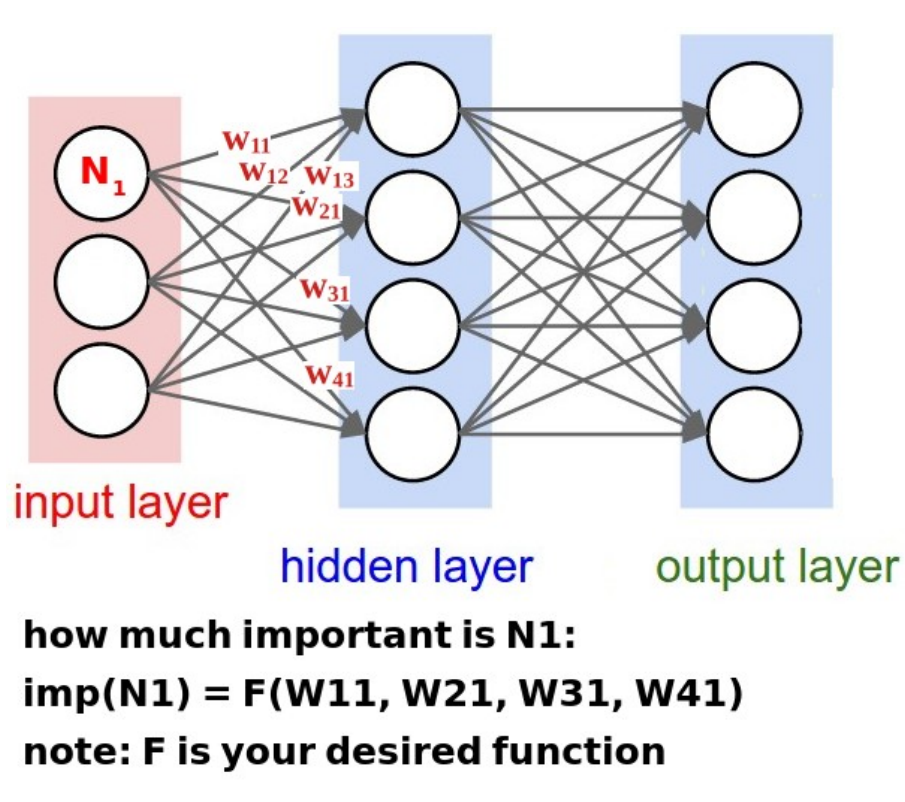
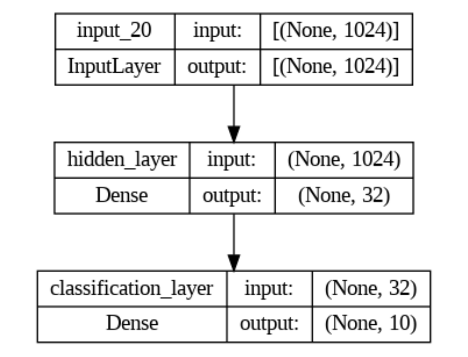
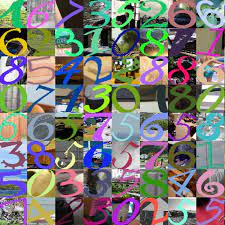

# Feature Selection - Phase 3

  

## Overview

This project focuses on feature selection and aims to provide a clear and efficient process for working with the SYN dataset. Feature selection is crucial in machine learning projects, and this project guides you through the process.

## Table of Contents

- [Starter Materials](#starter-materials)
- [Project Instructions](#project-instructions)
- [Directory Structure](#directory-structure)
- [Usage](#usage)
- [Data](#data)

## Starter Materials

The starter materials include essential resources to begin your project:

- [network.ipynb]([link-to-network.ipynb](https://drive.google.com/file/d/11XSW5M5SPO6Ld_ofVkzMSQzpdRyHlfds/view?usp=sharing)): Starter code for implementing the network.
- [data]([link-to-data-folder](https://drive.google.com/drive/folders/1D0RaMSbJGJLLXv-ee-_6dM2aMe-A3ns2?usp=sharing)): Folder containing essential datasets and resources.
  - [train_data_SYN.npz]([link-to-train_data_SYN.npz](https://drive.google.com/file/d/1cZGbhbVqAlrrAVNruiH48iBLZ6kPdOlu/view?usp=sharing)): Training data extracted from the SYN dataset.
  - [test_data_SYN.npz]([link-to-test_data_SYN.npz](https://drive.google.com/file/d/10ddjYz6MYuV8VkRb5zN4eH7tw_VLy2E9/view?usp=sharing)): Test data extracted from the SYN dataset.
  - [loadData.ipynb]([link-to-loadData.ipynb](https://colab.research.google.com/drive/1R1xOTRtiB7M9dWlZOXNL7xWhmWdZD5LK?usp=sharing)): Code for loading and preprocessing the SYN dataset.

## Project Instructions

The complete project instructions can be found in the [CI - Spring 2023-Phase3.pdf]([link-to-instructions-pdf](https://github.com/hamedrq7/CAI-Spring-2023/blob/main/Third-Project%3A%20Feature%20Selection/CI%20-%20Spring%202023-Phase3.pdf)) document. It contains detailed requirements, objectives, and specific instructions for the project.

## Directory Structure

Here's a brief explanation of the contents of this GitHub repository:

- [phase_3_code.ipynb]([link-to-phase_3_code.ipynb](https://github.com/hamedrq7/CAI-Spring-2023/blob/main/Third-Project%3A%20Feature%20Selection/phase_3_code.ipynb)): Completed project code with implemented feature selection and visualizations.

<!-- Create a table with one row and two columns -->
<table>
  <tr>
    <td align="center">
      
       
      loss
    </td>
    <td align="center">
      
       
      accuracy
    </td>
  </tr>
  <tr>
    <td align="center">
      
       
      best features according to the weights
    </td>
    <td align="center">
      
       
      comparing best and worst features according to overall weights
    </td>
  </tr>
    <tr>
    <td align="center">
      
       
      Comparing best and worst features according to overall absolute weights in sorted view
    </td>
  </tr>
</table>

- [readme.md]([link-to-readme.md](https://github.com/hamedrq7/CAI-Spring-2023/blob/main/Third-Project%3A%20Feature%20Selection/readme.md)): You're currently reading the project README.

## Usage

To use this project, follow these steps:

1. Review the project instructions in [CI - Spring 2023-Phase3.pdf]([link-to-instructions-pdf](https://github.com/hamedrq7/CAI-Spring-2023/blob/main/Third-Project%3A%20Feature%20Selection/CI%20-%20Spring%202023-Phase3.pdf)).

2. Use the starter materials in the [data]([link-to-data-folder](https://drive.google.com/drive/folders/1D0RaMSbJGJLLXv-ee-_6dM2aMe-A3ns2?usp=sharing)) directory to load and preprocess the SYN dataset for your feature selection.

3. Use the feature selection process that is implemented in [phase_3_code.ipynb]([link-to-phase_3_code.ipynb](https://github.com/hamedrq7/CAI-Spring-2023/blob/main/Third-Project%3A%20Feature%20Selection/phase_3_code.ipynb)).

  

4. Use the code in [network.ipynb]([link-to-network.ipynb](https://drive.google.com/file/d/11XSW5M5SPO6Ld_ofVkzMSQzpdRyHlfds/view?usp=sharing)) to set up and implement your network.

  

## Data

The SYN dataset, also known as the **SYN Digits Dataset**, is a well-known dataset consisting of images of handwritten digits. This dataset is widely used in the machine learning and computer vision communities for tasks such as digit recognition and classification.

  

**Dataset Details:**

- **Source:** The SYN Digits Dataset is commonly used as a benchmark dataset for various machine learning and computer vision projects. The dataset contains a collection of images of handwritten digits, which are often used for tasks like digit recognition, classification, and image processing.

- **Contents:** The dataset includes a substantial number of grayscale images, each depicting a handwritten digit from 0 to 9. These images serve as the primary data for your feature selection and classification tasks in this project.

- **Format:** Images in the SYN dataset are typically stored as pixel values in a matrix format, making them suitable for training and testing machine learning models.

The SYN dataset is a popular choice for practicing feature selection, image classification, and other machine learning tasks. You can find more information and resources related to this dataset in the project instructions provided in [CI - Spring 2023-Phase3.pdf](link-to-instructions-pdf).
